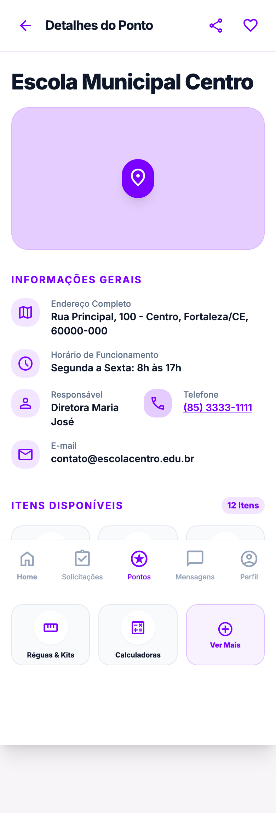

# 🎒 Projeto Mochila Cheia

O **Mochila Cheia** é uma plataforma digital (aplicativo web) que visa conectar doadores de materiais escolares a estudantes que necessitam desses itens. A solução busca combater o desperdício, promover a sustentabilidade e gerar impacto social positivo, facilitando o acesso a recursos educacionais para famílias de baixa renda.

> **Projeto Integrado III** - Análise e Desenvolvimento de Sistemas (ADS)  
> Universidade Federal do Cariri (UFCA) - Centro de Educação a Distância (CEAD)

---

## 📋 Índice

- [Objetivo](#-objetivo)
- [Importância da Experiência do Usuário (UX)](#-importância-da-experiência-do-usuário-ux)
- [Contextualização do Projeto](#-contextualização-do-projeto)
- [Funcionalidades Principais](#-funcionalidades-principais-mvp)
- [Tecnologias Utilizadas](#-tecnologias-utilizadas)
- [Estrutura do Projeto](#-estrutura-do-projeto)
- [Como Executar](#-como-executar)
- [Demonstração do MVP](#-demonstração-do-mvp)
- [Processo de Desenvolvimento](#-processo-de-desenvolvimento)
- [Como Utilizar a Aplicação](#-componente-extensionista-como-utilizar-a-aplicação)
- [Classes do Sistema](#-classes-do-sistema)
- [Banco de Dados](#-banco-de-dados)
- [Wireframe e Sitemap](#-wireframe-e-sitemap-do-mvp)
- [Possíveis Usos da Nossa Solução](#-componente-extensionista-possíveis-usos-da-nossa-solução)
- [O que é Projeto Físico de Banco de Dados](#-componente-extensionista-o-que-é-projeto-físico-de-banco-de-dados)
- [Como Prototipar um Wireframe](#-componente-extensionista-como-prototipar-um-wireframe)
- [Equipe](#-equipe)
- [Licença](#-licença)

---

## 🎯 Objetivo

Criar uma ponte eficiente e confiável entre quem tem materiais para doar e quem precisa, oferecendo um processo com logística simples, seguro e que garanta a privacidade dos usuários.

### O Problema

- **85% das famílias** têm o orçamento impactado pelos gastos com material escolar
- Em favelas, esse número chega a **89%** das famílias
- A falta de recursos básicos contribui para a **evasão escolar**
- Materiais em bom estado são descartados desnecessariamente

### A Solução

Uma plataforma que conecta:
- **Doadores**: Pessoas com materiais escolares em bom estado para doar
- **Receptores**: Estudantes e famílias que precisam desses materiais
- **Pontos de Coleta**: Locais parceiros que facilitam a logística

---
## 🌟 Importância da Experiência do Usuário (UX)

Um bom design de interface vai muito além da estética; ele tem o poder de democratizar o acesso à tecnologia e impactar positivamente a vida das pessoas como um todo. No mundo real, sistemas com uma UX bem planejada reduzem a carga cognitiva do usuário (redução de stress mental), evitam frustrações e tornam a realização de tarefas complexas algo intuitivo e acessível para todos, independentemente do seu nível de letramento digital (seja iniciante ou avançado). No contexto do **Mochila Cheia**, uma UX acolhedora e acessível é fundamental para garantir que famílias em situação de vulnerabilidade consigam solicitar materiais sem barreiras tecnológicas, enquanto incentiva doadores a concluírem o processo de doação de forma rápida e segura. Um sistema que busca a todo modo não parecer algo complicado.

## 📌 Contextualização do Projeto

* **Qual é o problema que a solução resolve?**
A plataforma resolve a dificuldade de famílias de baixa renda em arcar com os altos custos de materiais escolares (que impactam 85% dos orçamentos familiares e vêm aumentando ano após ano), combatendo o descarte desnecessário de materiais em bom estado e ajudando a mitigar a evasão escolar por falta de recursos básicos, além da questão ambiental que, mesmo pequena, é extremamente importante.

* **Qual é o objetivo do sistema?**
Criar uma ponte logística eficiente, segura e confiável entre pessoas que possuem materiais escolares para doar e os estudantes que necessitam desses itens, utilizando pontos de coleta parceiros para facilitar o processo. Buscando unir a disponibilidade de uns e a necessidade de outros.

* **Como o sistema funciona (visão geral)?**
O sistema conecta três perfis: Doadores (que cadastram itens disponíveis), Receptores (que buscam e solicitam itens) e Moderadores. Através de uma busca inteligente e um chat integrado, as partes combinam a entrega utilizando pontos de coleta parceiros, transmitindo confiança ao processo como um todo.

* **Quais tecnologias foram utilizadas?**
Para a prototipação e design de interfaces (foco desta etapa), utilizamos o **Figma**. O back-end e a estrutura lógica utilizam Python 3.10+, SQLite/PostgreSQL e controle de versão via Git/GitHub.

* **Como executar ou utilizar a aplicação?**
O protótipo de alta fidelidade pode ser acessado e navegado diretamente através do link público do Figma: [Acessar Protótipo no Figma](https://www.figma.com/design/VTX9EUtbKb7ZPAQW5SR7Ha/Mochila-Cheia---Wireframes?node-id=0-1&t=ZPmXkBwTpCOOfYV0-1). Para executar o código do backend localmente, basta clonar o repositório, instalar as dependências via `requirements.txt` e executar `python main.py` na pasta `src`.

* **Quais decisões foram tomadas ao longo do desenvolvimento?**
Durante o design, priorizamos a acessibilidade (contraste 4.5:1 da WCAG 2.1) e a usabilidade (aplicando as Heurísticas de Nielsen). Optamos por uma navegação via *bottom tab* para facilitar o uso em dispositivos móveis, criamos *badges* de status para dar visibilidade clara sobre a situação das doações e focamos em formulários com validação imediata para prevenir erros do usuário.


## ✨ Funcionalidades Principais (MVP)

| Funcionalidade | Descrição |
|----------------|-----------|
| **Cadastro de Usuários** | Perfis para Doadores, Receptores e Moderadores |
| **Publicação de Itens** | Cadastro de materiais com fotos, descrição e estado |
| **Busca Inteligente** | Filtros por categoria, localização e disponibilidade |
| **Sistema de Moderação** | Aprovação de itens antes de ficarem disponíveis |
| **Solicitação de Itens** | Receptores podem solicitar itens disponíveis |
| **Chat Integrado** | Comunicação entre doadores e receptores |
| **Notificações** | Alertas sobre solicitações e atualizações |

---

## 🔧 Tecnologias Utilizadas

| Tecnologia | Uso | Por que escolhemos |
|------------|-----|--------------------|
| **Python 3.10+** | Linguagem principal | Sintaxe clara, ideal para a equipe evoluir junta e para o contexto acadêmico |
| **Flask 3** | Framework web (rotas, sessões, templates) | Leve e explícito: cada camada do MVC fica visível, sem "mágica" de frameworks maiores |
| **Jinja2** | Motor de templates das telas | Integrado ao Flask, permite reutilizar layout base e componentes entre as páginas |
| **Tailwind CSS** | Estilização da interface | Agilizou a tradução dos protótipos do Figma para telas responsivas mobile-first |
| **SQLite** | Banco de dados do MVP | Zero configuração: o banco é criado por script e roda em qualquer máquina |
| **PostgreSQL** | Banco para produção (futuro) | Caminho natural de evolução mantendo o mesmo SQL |
| **bcrypt** | Hash de senhas | Padrão de mercado para armazenar credenciais com segurança |
| **pytest** | Testes unitários dos modelos | Rápido de escrever e de rodar a cada mudança |
| **Playwright** | Teste end-to-end no navegador | Valida o fluxo real (publicar → moderar → solicitar) e gera os prints de evidência |
| **Git/GitHub** | Controle de versão e repositório | Trabalho em paralelo da equipe com histórico rastreável |

### Dependências Python

```
Flask>=3.0.0
dataclasses-json>=0.6.0
python-dateutil>=2.8.2
bcrypt>=4.0.0
pytest>=7.4.0
```

---

## 📁 Estrutura do Projeto

```
mochila-cheia/
├── README.md                 # Este arquivo
├── requirements.txt          # Dependências Python
├── src/
│   ├── __init__.py
│   ├── models/               # Classes de domínio
│   │   ├── __init__.py
│   │   ├── usuario.py        # Classe Usuario
│   │   ├── item.py           # Classe Item
│   │   ├── solicitacao.py    # Classe Solicitacao
│   │   ├── ponto_coleta.py   # Classe PontoDeColeta
│   │   ├── categoria.py      # Classe Categoria
│   │   └── mensagem.py       # Classe Mensagem
│   └── main.py               # Demonstração do sistema
├── database/
│   ├── schema.sql            # DDL - Projeto Físico
│   └── seed.sql              # Dados de exemplo
├── docs/
│   ├── EP1_Relatorio.md      # Relatório EP1 (POO)
│   ├── EP2_Relatorio.md      # Relatório EP2 (Banco)
│   ├── EP3_Relatorio.md      # Relatório EP3 (IHC)
│   ├── EP3_Sitemap.md        # Sitemap do MVP
│   ├── diagramas/            # Diagramas do projeto
│   │   ├── DiagramaCasoDeUso.md
│   │   └── derMC.drawio
│   └── docs2025/             # Documentos das sprints anteriores
└── tests/
    └── test_models.py        # Testes unitários
```

---

## 🚀 Como Executar

### 1. Clone o repositório

```bash
git clone https://github.com/chico-piaba/mochila-cheia.git
cd mochila-cheia
```

### 2. Crie um ambiente virtual (opcional, mas recomendado)

```bash
python3 -m venv venv
source venv/bin/activate  # Linux/Mac
# ou
venv\Scripts\activate     # Windows
```

### 3. Instale as dependências

```bash
pip install -r requirements.txt
```

### 4. Crie o banco de dados com dados de exemplo

```bash
flask --app run init-db
```

### 5. Execute a aplicação web

```bash
flask --app run run --debug
```

Acesse **http://127.0.0.1:5000** no navegador (recomendamos o modo
responsivo/celular do DevTools — o design é mobile-first).

### 6. Acesse com os usuários de exemplo

A senha de todos é `senha123`:

| Perfil | E-mail |
|--------|--------|
| Doadora | `maria.silva@email.com` |
| Receptor | `joao.pedro@email.com` |
| Moderador | `admin@mochilacheia.com` |

### (Opcional) Demonstração de console dos modelos

A fase anterior do projeto incluiu uma demonstração das classes via terminal:

```bash
cd src && python main.py
```

### (Opcional) Rodar os testes

```bash
python -m pytest tests --ignore=tests/e2e   # 18 testes unitários
python tests/e2e/teste_playwright.py        # e2e (requer app rodando na porta 5001)
```

---

## 📸 Demonstração do MVP

O fluxo completo — doadora publica → moderador aprova → receptor
solicita → chat → aceite — está gravado em vídeo em
[`docs/evidencias/demo-mochila-cheia.mp4`](docs/evidencias/demo-mochila-cheia.mp4).
Os prints abaixo são gerados automaticamente pelo teste end-to-end
(Playwright) navegando a aplicação real:

| Vitrine (Home) | Publicar Item | Fila de Moderação |
|---|---|---|
|  |  |  |

| Minhas Solicitações | Chat | Pontos de Coleta |
|---|---|---|
|  |  |  |

As 20 telas capturadas estão em [`docs/evidencias/playwright/`](docs/evidencias/playwright/).

---

## 🧑‍💻 Processo de Desenvolvimento

**Divisão de tarefas.** A equipe se organizou em duas frentes que
trabalharam em paralelo: *Arquitetura/Backend* (Rodrigo, Júlio e
Gabriela — modelagem do banco, blueprints, repositórios e regras de
negócio) e *IHC/UX* (Robson, Maria e Lucas — protótipos no Figma,
templates das telas e acessibilidade). A arquitetura em camadas foi
decidida justamente para que as frentes não conflitassem: quem fazia
telas não tocava em SQL, e quem fazia backend não tocava em layout.

**Versionamento.** O desenvolvimento aconteceu na branch `main` com
commits pequenos e descritivos por etapa (`feat:`, `test:`, `docs:`),
representando a evolução real: protótipos → backend do fluxo de doação
→ integração das telas → testes e evidências.

**Dificuldades e soluções.**
- *Integração frontend/backend:* os templates vindos do protótipo
  usavam dados estáticos (imagens e textos de exemplo "hardcoded").
  A solução foi criar a camada de repositórios e revisar tela por tela
  ligando cada elemento ao banco — o teste e2e com Playwright foi criado
  para provar que nenhuma tela ficou "de mentira".
- *Fotos dos itens:* as URLs de exemplo do seed não existiam e as
  imagens apareciam quebradas. Resolvemos com imagens locais versionadas
  no repositório e upload real de fotos com validação de extensão.
- *Segurança do fluxo:* para evitar conteúdo indevido, decidimos que
  nenhum item publicado aparece na vitrine sem passar pela fila de
  moderação — regra garantida no repositório de itens e coberta pelo
  teste e2e.

---

## 🤝 [Componente Extensionista] Como Utilizar a Aplicação

**Como acessar.** Qualquer pessoa pode abrir o endereço da aplicação no
navegador do celular ou do computador — não é preciso instalar nada. A
vitrine de itens é pública; para doar ou solicitar basta criar uma conta
gratuita com nome e e-mail.

**Como usar as principais funções.**
- *Quero doar:* crie a conta, toque no botão **+**, preencha título,
  categoria, estado de conservação, descrição e anexe uma foto. Seu item
  passa por uma rápida moderação e entra na vitrine.
- *Preciso de material:* navegue pela vitrine ou filtre por categoria,
  abra o item e toque em **Solicitar Item**. Acompanhe o pedido em
  "Minhas Solicitações".
- *Combinar a entrega:* quando o doador aceita, vocês conversam pelo
  chat interno — sem precisar trocar telefone — e podem combinar a
  retirada em um ponto de coleta parceiro (escolas e bibliotecas
  cadastradas no app, com endereço e horário).

**Qual problema resolve.** O material escolar pesa no orçamento da
maioria das famílias brasileiras, e ao mesmo tempo mochilas, livros e
uniformes em bom estado são jogados fora. A aplicação faz essa ponte:
transforma o que sobra na casa de uns no que falta na casa de outros.

**Quem pode se beneficiar.**
- Famílias de baixa renda que não conseguem comprar o material completo;
- Doadores que querem dar destino útil a materiais parados;
- Escolas públicas e bibliotecas, que ganham papel ativo como pontos de
  coleta da comunidade;
- ONGs e projetos sociais, que podem usar a plataforma para organizar
  campanhas de arrecadação.

**Cenários reais de uso.** No início do ano letivo, uma escola pública
pode se cadastrar como ponto de coleta e concentrar doações da
vizinhança para as famílias dos alunos. Uma família cujo filho trocou de
etapa escolar pode doar o uniforme e os livros do ano anterior em vez de
descartá-los. Em situações de emergência — como enchentes que destroem
material escolar — a plataforma permite direcionar rapidamente doações
para as famílias atingidas.

**Impacto esperado.** Além do alívio direto no orçamento das famílias e
da redução do desperdício, acreditamos que o principal impacto é na
permanência escolar: uma criança com mochila, caderno e uniforme tem
uma barreira a menos para continuar estudando.

---

## 📦 Classes do Sistema

### Diagrama de Classes Simplificado

```
┌─────────────┐     ┌─────────────┐     ┌─────────────┐
│   Usuario   │     │  Categoria  │     │ PontoColeta │
├─────────────┤     ├─────────────┤     ├─────────────┤
│ id_usuario  │     │ id_categoria│     │ id_ponto    │
│ nome        │     │ nome        │     │ nome        │
│ email       │     │ descricao   │     │ endereco    │
│ tipo_usuario│     └─────────────┘     │ horario     │
└─────────────┘             │           └─────────────┘
      │                     │
      │        ┌────────────┴────────────┐
      │        │                         │
      ▼        ▼                         │
┌─────────────────┐                      │
│      Item       │◄─────────────────────┘
├─────────────────┤
│ id_item         │
│ titulo          │
│ estado          │
│ status          │
│ doador          │──────► Usuario (composição)
│ categoria       │──────► Categoria (composição)
└─────────────────┘
        │
        │
        ▼
┌─────────────────┐     ┌─────────────────┐
│   Solicitacao   │     │    Mensagem     │
├─────────────────┤     ├─────────────────┤
│ id_solicitacao  │     │ id_mensagem     │
│ item            │     │ remetente       │
│ solicitante     │     │ destinatario    │
│ doador          │     │ conteudo        │
│ status          │     │ solicitacao     │
└─────────────────┘     └─────────────────┘
```

### Princípios de POO Aplicados

| Princípio | Aplicação no Projeto |
|-----------|---------------------|
| **Encapsulamento** | Atributos privados (`_nome`) com acesso via `@property` |
| **Abstração** | Classes modelam entidades do mundo real (Usuario, Item) |
| **Composição** | Item contém referência a Usuario (doador) e Categoria |
| **Agregação** | Solicitação referencia Item e Usuario (podem existir independentemente) |

---

## 🗄️ Banco de Dados

### Modelo Entidade-Relacionamento

```
USUARIO (1) ──────────────── (N) ITEM
    │                              │
    │                              │
    └─── (1) ─── SOLICITACAO ─── (N) ───┘
                     │
                     │
                MENSAGEM (N)
```

### Tabelas Principais

| Tabela | Descrição |
|--------|-----------|
| `USUARIO` | Doadores, receptores e moderadores |
| `CATEGORIA` | Tipos de materiais escolares |
| `ITEM` | Materiais disponíveis para doação |
| `SOLICITACAO` | Pedidos de itens por receptores |
| `MENSAGEM` | Chat entre usuários |
| `PONTO_COLETA` | Locais parceiros |
| `NOTIFICACAO` | Alertas do sistema |

---

## 🖼️ Wireframe e Sitemap do MVP

O wireframe e o sitemap foram desenvolvidos no EP3 com foco em **IHC (Interação Humano-Computador)**, aplicando princípios de usabilidade (Heurísticas de Nielsen) e acessibilidade (WCAG 2.1).

### Sitemap — Visão Geral da Navegação

A plataforma possui 3 fluxos de navegação, um para cada perfil de usuário:

| Perfil | Telas Principais | Objetivo |
|--------|-----------------|----------|
| **Doador** | Home, Cadastrar Item, Meus Itens, Solicitações Recebidas, Mensagens | Publicar itens e gerenciar solicitações de doação |
| **Receptor** | Home (Busca), Detalhes do Item, Minhas Solicitações, Pontos de Coleta, Mensagens | Encontrar e solicitar materiais escolares |
| **Moderador** | Painel, Fila de Moderação, Revisar Item | Garantir a qualidade dos itens publicados |

> 📄 Sitemap completo com diagramas: [`docs/EP3_Sitemap.md`](docs/EP3_Sitemap.md)

### Princípios de Design Aplicados

| Área | Referência | Exemplos no Projeto |
|------|-----------|---------------------|
| **Usabilidade** | 10 Heurísticas de Nielsen | Badges de status, navegação por bottom tab, validação de formulários, confirmação de ações |
| **Acessibilidade** | WCAG 2.1 (Níveis A e AA) | Contraste 4.5:1, textos alternativos, alvos de toque 48x48dp, hierarquia de títulos |

> 📄 Justificativas detalhadas: [`docs/EP3_Relatorio.md`](docs/EP3_Relatorio.md)

---

## 🌍 [Componente Extensionista] Possíveis Usos da Nossa Solução

A plataforma **Mochila Cheia** foi idealizada para a doação de material escolar, mas seu modelo de intermediação logística pode ser expandido para resolver outros problemas reais, beneficiando diversas comunidades e negócios.

### 1. Apoio a Vítimas de Desastres Naturais

Em situações de emergência, como enchentes ou deslizamentos, a plataforma poderia ser adaptada para se tornar um canal centralizado de doações de itens essenciais (roupas, alimentos não perecíveis, água, kits de higiene). ONGs e a Defesa Civil poderiam atuar como "Pontos de Coleta" verificados, garantindo que as doações cheguem rapidamente a quem mais precisa e evitando o caos logístico comum nessas situações.

### 2. Logística Reversa para Pequenos Negócios

Pequenas empresas e e-commerces enfrentam altos custos com a logística reversa (devolução de produtos). A plataforma poderia ser usada para criar uma rede de "pontos de devolução" em comércios locais (padarias, farmácias). Um cliente que precisa devolver um produto poderia simplesmente deixá-lo no ponto mais próximo, e a plataforma notificaria a empresa para organizar a coleta de múltiplos itens de uma só vez, otimizando rotas e reduzindo custos de transporte.

### 3. Doação de Equipamentos para ONGs e Escolas Públicas

Escolas e organizações sociais frequentemente precisam de equipamentos específicos (computadores, projetores, instrumentos musicais) que empresas ou pessoas físicas têm disponíveis para doação. A plataforma poderia ter uma área dedicada para "listas de desejos", onde instituições publicam suas necessidades. Doadores poderiam consultar essas listas e oferecer exatamente o que é preciso, garantindo que a ajuda seja direcionada e efetiva.

### 4. Banco de Livros Comunitário

Bibliotecas comunitárias e escolas públicas poderiam usar a plataforma para criar um sistema de empréstimo e doação de livros. Moradores doariam livros que não usam mais, e estudantes poderiam solicitá-los para leitura ou pesquisa, devolvendo depois para que outros também possam usar.

> Esses exemplos demonstram o potencial da solução como uma ferramenta flexível para fortalecer a **economia circular** e as **redes de solidariedade**.

---

## 📚 [Componente Extensionista] O que é Projeto Físico de Banco de Dados

### Para quem está começando a programar

O **Projeto Físico de Banco de Dados** é a etapa onde transformamos o modelo conceitual (aqueles diagramas com caixas e linhas) em algo que o computador realmente entende: tabelas, colunas e regras.

### Analogia Simples

Imagine que você vai construir uma casa:

1. **Modelo Conceitual** = O rascunho no papel (quantos quartos, onde fica a cozinha)
2. **Modelo Lógico** = A planta técnica (medidas, posição das portas)
3. **Modelo Físico** = A construção real (tijolos, cimento, encanamento)

No banco de dados, o **Projeto Físico** é como construir a casa de verdade. Definimos:

- **Tabelas**: Como organizar os dados (como as divisões dos cômodos)
- **Tipos de dados**: Se um campo guarda texto, número ou data
- **Chaves primárias**: O "CPF" de cada registro (identificação única)
- **Chaves estrangeiras**: Como as tabelas se conectam
- **Índices**: Atalhos para encontrar dados mais rápido

### Por que isso é importante?

| Motivo | Explicação |
|--------|------------|
| **Performance** | Um banco bem projetado responde rápido |
| **Segurança** | Regras impedem dados errados ou duplicados |
| **Manutenção** | Código organizado é mais fácil de atualizar |
| **Escalabilidade** | O sistema cresce sem quebrar |

### Exemplo Prático

No nosso projeto, a tabela `ITEM` precisa saber quem é o doador. Em vez de repetir o nome do doador em cada item (o que seria um desperdício), usamos uma **chave estrangeira** que aponta para a tabela `USUARIO`:

```sql
CREATE TABLE ITEM (
    id_item INTEGER PRIMARY KEY,
    titulo VARCHAR(100) NOT NULL,
    fk_id_doador INTEGER REFERENCES USUARIO(id_usuario)
);
```

Assim, se o doador mudar de nome, atualizamos em um único lugar!

> **Dica para estudantes**: Pratique criando pequenos bancos de dados para seus projetos pessoais. Comece simples e vá adicionando complexidade conforme aprende.

---
## 🎨 [Componente Extensionista] Como Prototipar um Wireframe?

Se você está começando a programar ou criar sistemas agora, pode ficar ansioso para já sair escolhendo cores, fontes e botões bonitos. Mas, antes de decorar a casa, precisamos levantar as paredes. É exatamente para isso que serve um **Wireframe**.

Um wireframe é como o "esqueleto" ou a "planta baixa" "uma ideia abstrata" de um aplicativo ou site. É um desenho visual simples que mostra onde cada elemento (texto, botão, imagem) vai ficar na tela, sem se preocupar com a estética final. Isso se fundamenta mais ainda pois um projeto muito sofisticado nessa fase do projeto, até mesmo inibiria a formulação de novas ideias. 

### Passo a Passo para Prototipar o seu Primeiro Wireframe:

**1. Esqueça as Cores e Imagens (Por enquanto)**
A regra de ouro do wireframe é usar tons de cinza, preto e branco . Use caixas com um "X" no meio para representar onde ficarão as imagens e blocos de linhas para representar textos. O objetivo aqui é focar na **estrutura e navegação**, não no design visual. Algo funcional para passar uma ideia abstrata que sofrerá melhorias. 

**2. Comece no Papel (Baixa Fidelidade)**
A ferramenta mais rápida do mundo é papel e caneta. Desenhe retângulos simulando a tela do celular ou do computador e comece a rabiscar. Onde fica o menu? Onde fica o botão principal? Errou? Amasse e faça outro em segundos. Uma boa ideia que algumas pessoas usam é até mesmo um quadro branco e pincel e caneta.

**3. Vá para o Digital (Média Fidelidade)**
Depois de validar a ideia no papel e passar até mesmo pela fase colaborativa, passe para o computador. Existem ferramentas gratuitas e excelentes para isso, como o **Figma**, **Balsamiq** ou até mesmo o **Excalidraw**. Nelas, você consegue alinhar os elementos perfeitamente e ter uma noção real do tamanho das coisas e até mesmo fazer uma complementação entre eles

**4. Pense na Hierarquia Visual**
O que é mais importante na sua tela? Esse elemento deve ser maior ou estar no topo. Se o objetivo do seu app é fazer doações (como no nosso projeto *Mochila Cheia*), o botão de "Doar Agora" deve ter destaque e ser a primeira coisa que o usuário vê.

**5. Teste o Fluxo**
O wireframe não é apenas uma tela isolada. Desenhe as telas seguintes e ligue-as com setas. "Se o usuário clicar aqui, ele vai para esta tela". Isso ajuda a encontrar becos sem saída ou etapas confusas antes mesmo de escrever a primeira linha de código.


**Por que isso importa?**
Fazer wireframes economiza tempo e dinheiro. É muito mais rápido (e barato) apagar um quadrado no Figma ou no papel do que ter que reescrever horas de código porque o botão ficou no lugar errado e o usuário não conseguiu usar o sistema. 

## 🏗️ [Componente Extensionista] O que é Arquitetura de Software?

Para explicar o que é arquitetura de software, gosto de pensar na construção de uma casa. Antes de levantar as paredes ou escolher a cores da tinta, um engenheiro/mestre de obra precisa desenhar a planta. Ele define onde passa a rede elétrica, o encanamento e como os cômodos se conectam para que a casa não desabe no futuro. 

Na programação, a **Arquitetura de Software** é exatamente essa "planta baixa" do sistema. É o planejamento estrutural de como as diferentes partes do código vão se organizar e conversar entre si. 

No caso do nosso projeto, o **Mochila Cheia**, optamos por uma arquitetura dividida em camadas. Por que isso é importante no mundo real? 
1. **Organização e Foco:** Separamos as telas que o usuário vê (Apresentação - HTML/CSS) das regras de negócio (Controle/Domínio - Python) e do banco de dados (Persistência - SQLite).
2. **Trabalho em Equipe:** Com o sistema modularizado, pude focar em traduzir os protótipos do Figma para código e aplicar as "heurísticas" de acessibilidade sem o risco de quebrar a lógica de banco de dados ou as rotas que os outros desenvolvedores da equipe estavam estruturando.
3. **Manutenção:** Se amanhã precisarmos trocar o layout do site inteiro, mexemos apenas na camada visual, sem afetar o "motor" do sistema.

Em resumo, uma boa arquitetura garante que o sistema não apenas funcione no primeiro dia, mas que consiga crescer e receber novas funcionalidades de forma organizada, segura e sustentável no longo prazo.
---

## 👥 Equipe

| Nome | Função |
|------|--------|
| **Rodrigo Lima Diôgo** | Gestão, Comunicação e Arquitetura |
| **Júlio César Batista da Silva** | Backend e Análise de Fluxo |
| **Francisco Robson Paulino Cruz** | IHC/UX |
| **Maria da Conceição Freitas Lopes** | Documentação e IHC/UX |
| **Gabriela Araújo Lourenço** | Backend e Análise de Fluxo |
| **Lucas do Nascimento Souza** | IHC/UX |

### Nota sobre a Evolução da Equipe

Para a fase atual de desenvolvimento (Projeto Integrado III), a equipe foi reestruturada e expandida para 6 membros. Com a integração de novos colegas, o time conseguiu dividir as frentes de trabalho de forma mais eficiente, separando as demandas entre Arquitetura/Backend e IHC/UX. Essa nova formação trouxe mais fôlego para o projeto, garantindo a entrega do protótipo de alta fidelidade e da documentação com maior qualidade.

## 📄 Licença

Este projeto foi desenvolvido para fins acadêmicos como parte do **Projeto Integrado III** do curso de Análise e Desenvolvimento de Sistemas da UFCA.

---
