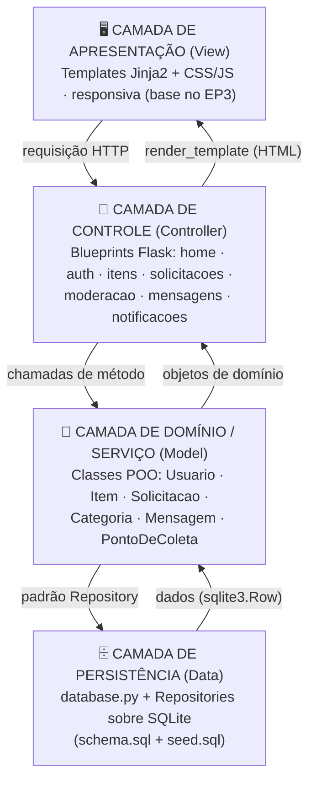
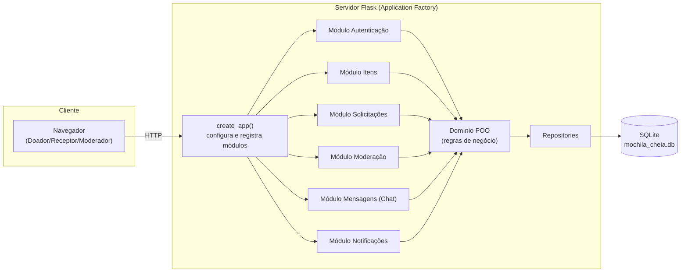
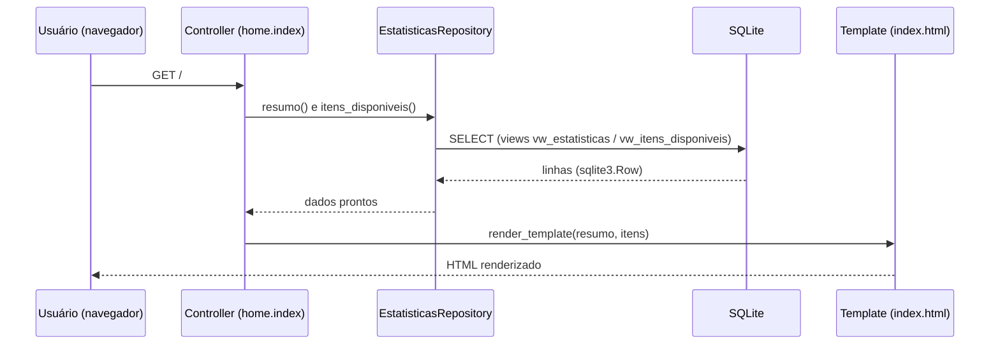

# Análise e Desenvolvimento de Sistemas (ADS)
## Centro de Educação a Distância (CEAD)

**PROJETO INTEGRADO III [ADS0038]**
**Prof. Luís Fabrício de Freitas Souza**
**fabricio.freitas@ufca.edu.br**

**Entregável Parcial 2 (EP2) – Modelo Arquitetural do MVP Web**

---

## Identificação do Time

| Nome | Matrícula | Função |
| :--- | :--- | :--- |
| Rodrigo Lima Diôgo | 2025014780 | Gestão, Comunicação e Arquitetura |
| Júlio César Batista da Silva | 2025014645 | Backend e Análise de Fluxo |
| Francisco Robson Paulino Cruz | 2025014458 | IHC/UX |
| Maria da Conceição Freitas Lopes | 2023011420 | Documentação e IHC/UX |
| Lucas do Nascimento Souza | 2023011395 | IHC/UX |

---

## 1) Explique de forma robusta e aprofundada como a equipe compreendeu e atendeu aos requisitos do entregável. Apresente evidências (prints, gifs, etc).

Nesta etapa, a equipe transformou o núcleo de domínio do **Mochila Cheia** — desenvolvido em Programação Orientada a Objetos nos Projetos Integrados anteriores — em um **MVP Web funcional**, organizado segundo um modelo arquitetural claro. O objetivo foi demonstrar como o sistema está estruturado tecnicamente, evidenciando as decisões adotadas, as tecnologias escolhidas e a organização dos componentes.

### a) Visão Geral da Arquitetura

**Qual problema o sistema resolve.** O Mochila Cheia combate o impacto financeiro e a evasão escolar causados pelo alto custo do material escolar, conectando **doadores** (pessoas com materiais em bom estado) a **receptores** (estudantes e famílias em vulnerabilidade), com apoio de **pontos de coleta** parceiros para a logística.

**Qual o objetivo do MVP.** Entregar, de ponta a ponta, o fluxo principal da doação: cadastro/login, publicação de itens, moderação, busca, solicitação, comunicação (chat) e notificações — em uma aplicação web responsiva e acessível.

**Quem são os usuários.** Três perfis: **Doador**, **Receptor** e **Moderador**, cada um com um fluxo de navegação próprio (mapeados no sitemap do EP3).

**Como a aplicação está organizada.** O sistema segue o padrão **MVC em arquitetura de camadas**, no modelo **cliente-servidor**. O navegador (cliente) faz requisições HTTP; o servidor Flask processa, aplica as regras de negócio sobre as classes de domínio (POO) e persiste/consulta os dados no SQLite, devolvendo páginas HTML renderizadas com Jinja2.

### b) Modelo Arquitetural do Sistema

#### Estrutura em camadas

O sistema é dividido em **quatro camadas**, cada uma com uma responsabilidade única e dependências apontando sempre para baixo:



| Camada | Responsabilidade | Onde está no código |
| :--- | :--- | :--- |
| **Apresentação** | Renderizar a interface e capturar interações do usuário | `src/web/templates/`, `src/web/static/` |
| **Controle** | Receber requisições, coordenar o fluxo, devolver respostas | `src/web/blueprints/` |
| **Domínio/Serviço** | Regras de negócio e estados (ex.: fluxo de status do Item) | `src/models/` |
| **Persistência** | Acesso ao banco, isolando o SQL do restante do sistema | `src/web/database.py`, `src/web/repositories/` |

Essa separação garante que uma mudança em uma camada (ex.: trocar SQLite por PostgreSQL) afete apenas aquela camada, sem quebrar as demais.

#### Componentes da aplicação



| Componente | Função | Como se comunica | Importância |
| :--- | :--- | :--- | :--- |
| **Application Factory** (`create_app`) | Cria e configura a aplicação, registra módulos e o banco | É o ponto de entrada; instancia tudo | Centraliza a configuração e torna o app testável |
| **Módulo de Autenticação** | Cadastro, login e logout dos 3 perfis | Usa `Usuario` (domínio) + sessão Flask | Porta de entrada e controle de acesso |
| **Módulo de Itens** | Publicar, buscar e detalhar materiais | Usa `Item` + `ItemRepository` | Coração do catálogo de doações |
| **Módulo de Solicitações** | Fluxo doador↔receptor (solicitar/aceitar/finalizar) | Usa `Solicitacao`, que altera o status do `Item` | Conduz a doação até a conclusão |
| **Módulo de Moderação** | Fila de aprovação/recusa de itens | Usa `Item.aprovar()/recusar()` | Garante qualidade e segurança do conteúdo |
| **Módulo de Mensagens** | Chat no contexto de uma solicitação | Usa `Mensagem` + tabela `MENSAGEM` | Aproxima doador e receptor |
| **Módulo de Notificações** | Alertas do sistema | Lê/escreve em `NOTIFICACAO` | Mantém o usuário informado (Heurística de Nielsen) |
| **Repositories** | Traduzem entre o banco e a aplicação | Recebem chamadas do domínio/controle | Isolam o SQL em um único lugar |

#### Tecnologias utilizadas

| Tecnologia | Uso | Por que foi escolhida |
| :--- | :--- | :--- |
| **Python 3.10+** | Linguagem principal | Reaproveita todo o domínio POO já implementado; sintaxe clara e produtiva |
| **Flask** | Framework web (controle + apresentação) | Micro-framework leve e flexível; impõe pouca estrutura, deixando a arquitetura em camadas explícita e didática |
| **Jinja2** | Motor de templates (View) | Integrado ao Flask; permite componentização de telas (herança de templates) |
| **SQLite** | Banco de dados (desenvolvimento) | Sem servidor, embarcado no Python; ideal para o MVP. Schema compatível com **PostgreSQL** em produção |
| **HTML5 + CSS3** | Interface responsiva | Padrões web; responsividade e acessibilidade (WCAG 2.1) sem dependências pesadas |
| **Git/GitHub** | Versionamento e colaboração | Permite dividir o trabalho por módulos entre os membros sem conflitos |
| **pytest** | Testes automatizados | Valida as regras de negócio e os fluxos principais |

A escolha do **Flask + Jinja** (em vez de um framework full-stack como Django) foi deliberada: como o domínio já existia em POO, um micro-framework permite **reaproveitar as classes** e manter cada camada visível, o que atende ao objetivo didático de evidenciar a arquitetura.

#### Integrações do sistema

| Integração | Estado | Descrição |
| :--- | :--- | :--- |
| **Sessão de autenticação** | Implementada (esqueleto) | Sessão do Flask para manter o usuário logado |
| **Banco de dados** | Implementada | Camada de persistência sobre SQLite (migração planejada para PostgreSQL) |
| **Sistemas de mapas** | Planejada | Geolocalização dos pontos de coleta (ex.: API de mapas) |
| **Envio de e-mail** | Planejada | Confirmação de cadastro e avisos de solicitação |
| **Armazenamento de imagens** | Planejada | Upload das fotos dos itens (hoje: URL no campo `foto_url`) |

### c) Decisões Arquiteturais

| Decisão | Justificativa (qualidade relacionada) |
| :--- | :--- |
| **MVC em camadas** | **Manutenção e organização**: cada responsabilidade isolada; mudanças ficam contidas |
| **Application Factory** | **Escalabilidade e testabilidade**: permite criar instâncias com configurações distintas (dev/produção/teste) |
| **Blueprints (um por módulo)** | **Organização do código e trabalho em equipe**: cada membro desenvolve seu módulo sem conflitar |
| **Padrão Repository** | **Manutenção e desempenho**: todo o SQL fica em um lugar; otimizar uma consulta não afeta a regra de negócio |
| **Reuso do domínio POO** | **Consistência**: as regras (ex.: fluxo de status do Item) ficam na classe, não espalhadas nas telas |
| **SQLite → PostgreSQL** | **Escalabilidade**: ambiente leve no MVP, com caminho claro de produção |
| **Hash de senha** | **Segurança**: senhas nunca são armazenadas em texto plano |
| **Views no banco** (`vw_itens_disponiveis`, `vw_estatisticas`) | **Desempenho e clareza**: consultas frequentes pré-definidas no Projeto Físico |

### d) Uso de Boas Práticas e Padrões Arquiteturais

**Boas práticas adotadas:**

- **Separação de responsabilidades** — cada camada e cada módulo têm um único propósito.
- **Clean Code** — nomes descritivos, funções curtas, docstrings em todos os módulos.
- **Reutilização de componentes** — herança de templates Jinja (`base.html`) e `BaseRepository` para o SQL genérico.
- **Padronização e organização de pastas** — estrutura previsível (`blueprints/`, `repositories/`, `templates/`).
- **Versionamento com Git** — histórico e divisão de tarefas por módulo.
- **Responsividade e acessibilidade** — layout mobile-first com bottom tab bar, contraste e alvos de toque adequados (WCAG 2.1).
- **Configuração externa** — parâmetros centralizados em `config.py`, fora do código dos módulos.

**Padrões arquiteturais aplicados:** MVC · Arquitetura em Camadas · Cliente-Servidor · Componentização (Blueprints e templates) · Repository · Application Factory.

#### Fluxo de uma requisição (exemplo real: página inicial)



### [Componente Extensionista] — README: "O que é Arquitetura de Software?"

Conforme exigido, o repositório recebeu no `README.md` a seção **"O que é Arquitetura de Software?"**, escrita com as palavras da equipe (IHC/UX — Robson), explicando o conceito e seu impacto em escalabilidade, segurança, desempenho, manutenção, evolução e qualidade do sistema.

---

## 2) Link do vídeo explicativo

**R:** [INSERIR LINK DO VÍDEO APÓS GRAVAÇÃO — máx. 5 min, todos os membros contribuindo, demonstrando o MVP Web e a documentação arquitetural]

---

## 3) Link do repositório no GitHub

- **Repositório:** https://github.com/chico-piaba/Mochila-Cheia
- **Protótipo Alta Fidelidade (Figma):** https://www.figma.com/design/VTX9EUtbKb7ZPAQW5SR7Ha/Mochila-Cheia---Wireframes

**Arquivos relevantes para o EP2 (PI3):**

```
src/web/                     # MVP Web (Flask) — modelo arquitetural
├── __init__.py              # Application Factory (create_app)
├── config.py                # Configuração por ambiente
├── database.py              # Camada de persistência (conexão + init-db)
├── repositories/            # Padrão Repository (acesso a dados)
├── blueprints/              # Controllers (um módulo por responsabilidade)
├── templates/               # Views (Jinja2)
└── static/css/              # Estilo responsivo
src/models/                  # Camada de domínio (POO) — reaproveitada
database/schema.sql          # Projeto Físico (DDL + views)
docs/EP2-PI3_Arquitetura.md  # Este documento
docs/diagramas/              # Diagramas arquiteturais
run.py                       # Ponto de entrada
```

---

## 4) Detalhe como cada membro da equipe contribuiu para o desenvolvimento do entregável?

**R:**

- **Rodrigo Lima Diôgo:** Definição do modelo arquitetural (MVC em camadas); implementação do núcleo/esqueleto do MVP Web (Application Factory, camada de persistência e padrão Repository); redação deste documento arquitetural e dos diagramas; coordenação da divisão de tarefas e organização do repositório.
- **Júlio César Batista da Silva:** Implementação dos módulos de backend (autenticação, itens, solicitações e moderação) e dos repositórios concretos sobre o banco; análise e codificação dos fluxos principais e das regras de negócio.
- **Francisco Robson Paulino Cruz:** Desenvolvimento da interface a partir do protótipo de alta fidelidade (Figma) para os templates Jinja/CSS; redação da seção extensionista "O que é Arquitetura de Software?" no README; atualização da documentação.
- **Maria da Conceição Freitas Lopes:** Consolidação da documentação técnica (descrição dos componentes e camadas); organização das evidências e revisão textual do relatório.
- **Lucas do Nascimento Souza:** Frontend dos módulos de mensagens (chat) e notificações; navegação (bottom tab bar) e jornada do usuário, garantindo consistência e acessibilidade.

---

## 5) Evidências das contribuições coletivas e individuais

**R:**

**MVP Web funcional (esqueleto em camadas):**
- Aplicação Flask sobe via `flask --app run run --debug`; todas as rotas respondem (home funcional + módulos em desenvolvimento sinalizados na própria interface).
- Comando `flask --app run init-db` recria o banco a partir de `schema.sql` + `seed.sql` (idempotente).

**Diagramas arquiteturais:** ver `docs/diagramas/EP2-PI3_DiagramasArquitetura.md` (camadas, componentes e fluxo de requisição em Mermaid).

**Evidências de reuniões e divisão de tarefas:**
- [INSERIR PRINTS/FOTOS DAS REUNIÕES E DO GRUPO DE WHATSAPP]
- [INSERIR PRINT DA APLICAÇÃO RODANDO NO NAVEGADOR]

---

## 6) Formulário de autoavaliação

Após o envio deste relatório no AVA, cada membro deve responder individualmente ao formulário de autoavaliação do time, somente após a conclusão da sprint.

---
