> **Documento interno da equipe.** Resume o que foi integrado nesta rodada, como
> foi testado (Playwright, ponta a ponta) e o que ainda falta por pessoa. Não é
> material de entrega ao professor — é o nosso "estado da obra".

---

## 1. Objetivo desta rodada

Fechar a **integração frontend ↔ backend** do MVP. Até aqui tínhamos o
esqueleto (camadas, blueprints, repositório de exemplo) e as telas do Figma,
mas os formulários **não falavam com o banco**: login, cadastro, publicação,
moderação e solicitação eram apenas visuais.

Nesta rodada o **fluxo de doação inteiro passou a funcionar de verdade** e está
coberto por um teste automatizado com captura de tela.

---

## 2. O que foi integrado

### 2.1 Backend (camada de persistência e regras) — completa o que faltava

| Arquivo | Função |
|---|---|
| `src/web/seguranca.py` | Hash de senha com **bcrypt** (contas novas) + verificação compatível com o **SHA-256** dos usuários de exemplo |
| `src/web/sessao.py` | Usuário logado, início de sessão e `@login_obrigatorio` |
| `repositories/usuario_repository.py` | Cadastro e autenticação |
| `repositories/item_repository.py` | Publicar, detalhe, listar, aprovar/recusar, reservar |
| `repositories/solicitacao_repository.py` | Criar e listar solicitações do fluxo de doação |
| `repositories/categoria_repository.py` | Resolve a categoria do formulário para o `id` do banco |

### 2.2 Controllers (blueprints) — agora tratam POST e sessão

- **auth**: login, cadastro (auto-login), logout, perfil — todos ligados ao banco
- **itens**: publicar (POST), meus itens, detalhe e detalhe do doador (dados reais)
- **solicitacoes**: criar solicitação e listar "minhas solicitações"
- **moderacao**: fila de pendentes, revisar, **aprovar/recusar** (rota protegida para o perfil `moderador`)

### 2.3 Frontend (telas ligadas + correções)

- `base.html`: passou a **carregar o `style.css`** (as telas do Robson estavam sem
  estilo) e a exibir **mensagens de feedback** (flash)
- `login.html`: virou **formulário POST de verdade** (antes era um link estático)
- **Corrigido o erro 500** da tela de detalhe (esperava uma variável `item` que
  ninguém passava)
- Meus itens, Minhas solicitações, Fila de moderação e Perfil agora mostram
  **dados reais** no lugar dos cards de exemplo

---

## 3. Teste automatizado (Playwright)

Script: `tests/e2e/teste_playwright.py` · roda em viewport de celular (390×844),
navega o fluxo real e salva as evidências em `docs/evidencias/playwright/`.

**Resultado: 12/12 verificações OK.**

| # | Verificação | Status |
|---|---|---|
| 1 | Tela de login renderiza | ✅ |
| 2 | Cadastro tem formulário | ✅ |
| 3 | Home lista itens disponíveis (banco) | ✅ |
| 4 | Detalhe mostra item real (sem erro 500) | ✅ |
| 5 | Item publicado entra em "meus itens" como **pendente** | ✅ |
| 6 | Item pendente **não** aparece na home | ✅ |
| 7 | Fila de moderação lista o item novo | ✅ |
| 8 | Tela de revisão mostra dados reais | ✅ |
| 9 | Após aprovar, o item **aparece na home** | ✅ |
| 10 | Solicitação criada aparece em "minhas solicitações" | ✅ |
| 11 | Perfil mostra o usuário logado | ✅ |
| 12 | Login inválido mostra mensagem de erro | ✅ |

**Como rodar o teste:**

```bash
# 1. (re)criar o banco com dados de exemplo
.venv/bin/python -c "from src.web import create_app; \
  app=create_app('development'); \
  app.app_context().push(); \
  from src.web.database import init_db; init_db()"

# 2. subir o servidor na porta 5001
.venv/bin/python -c "from src.web import create_app; \
  create_app('development').run(port=5001)" &

# 3. instalar o Playwright (uma vez) e rodar o teste
.venv/bin/pip install playwright && .venv/bin/python -m playwright install chromium
.venv/bin/python tests/e2e/teste_playwright.py
```

---

## 4. Evidências (capturas reais da aplicação rodando)

O teste percorre o ciclo completo: **doadora publica → moderador aprova →
receptor solicita.** As imagens abaixo foram geradas automaticamente.

### Autenticação

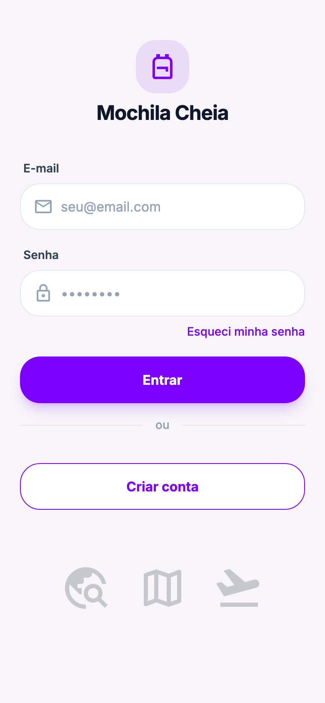{ width=32% }
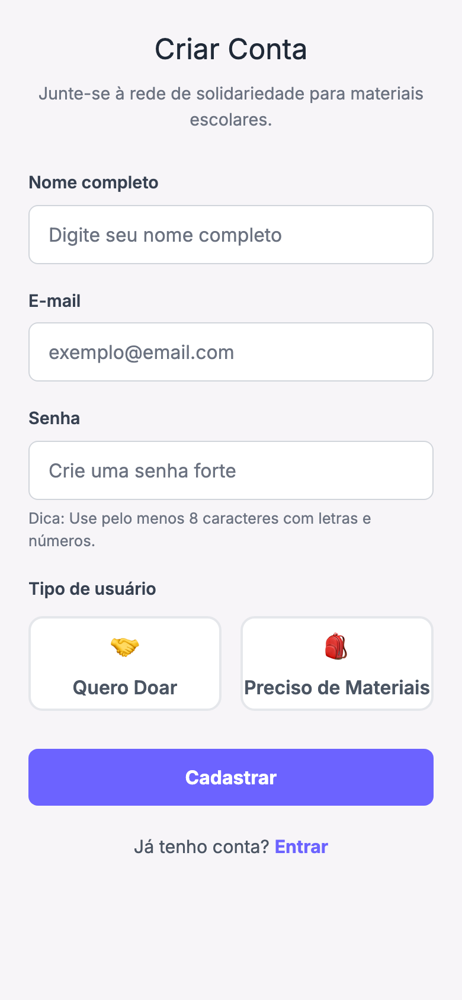{ width=32% }
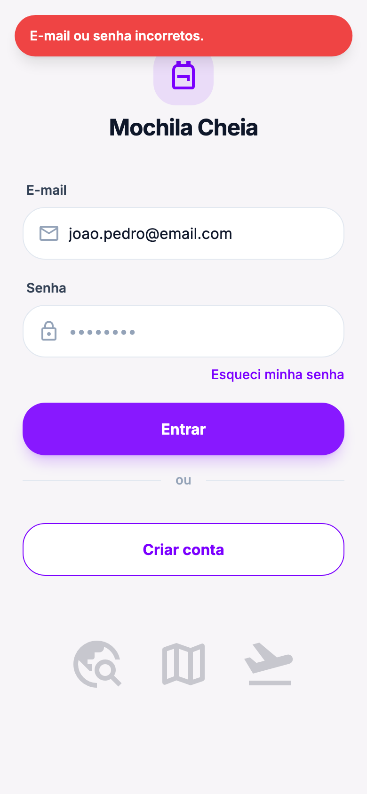{ width=32% }

### Busca e detalhe (dados reais do banco)

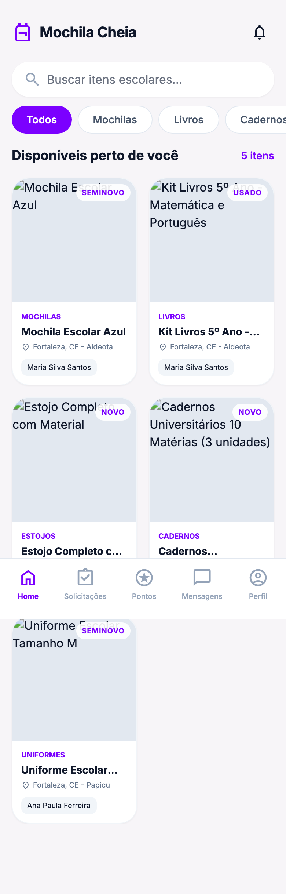{ width=32% }
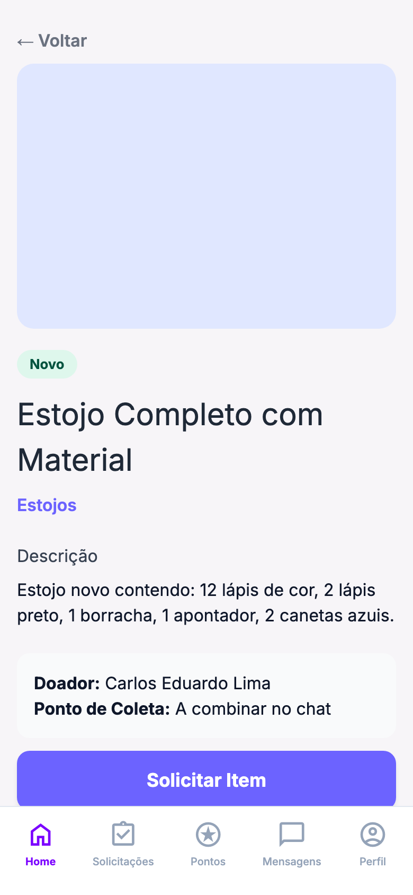{ width=32% }
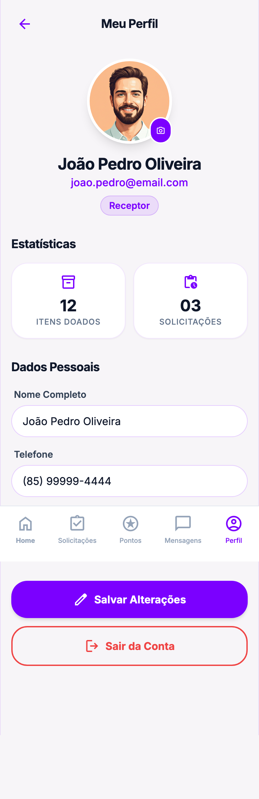{ width=32% }

### Fluxo do doador

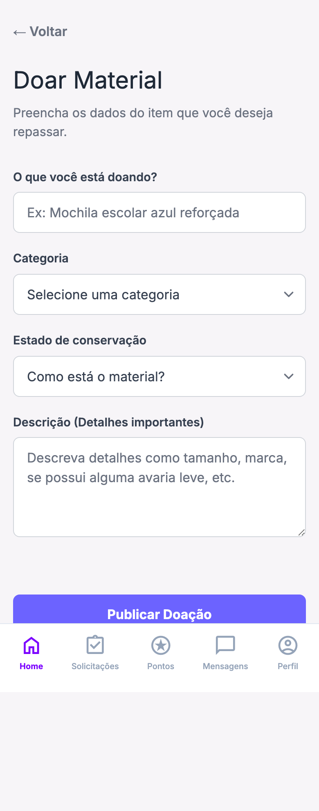{ width=32% }
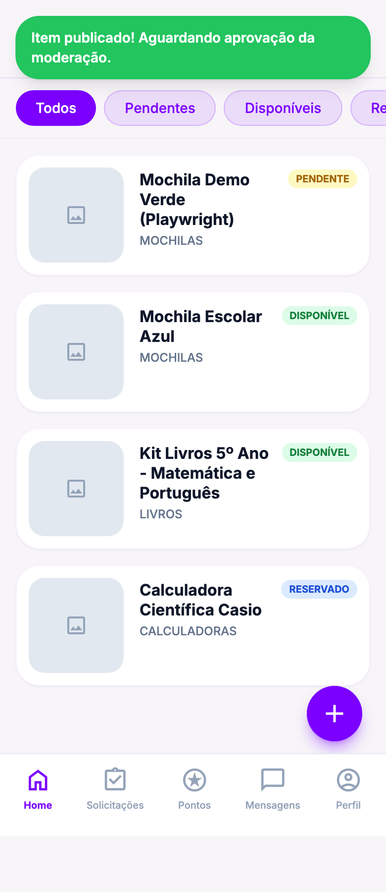{ width=32% }

### Fluxo de moderação

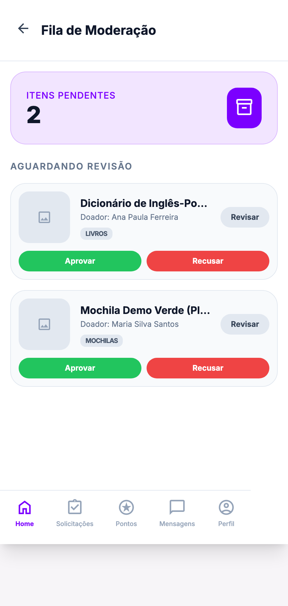{ width=32% }
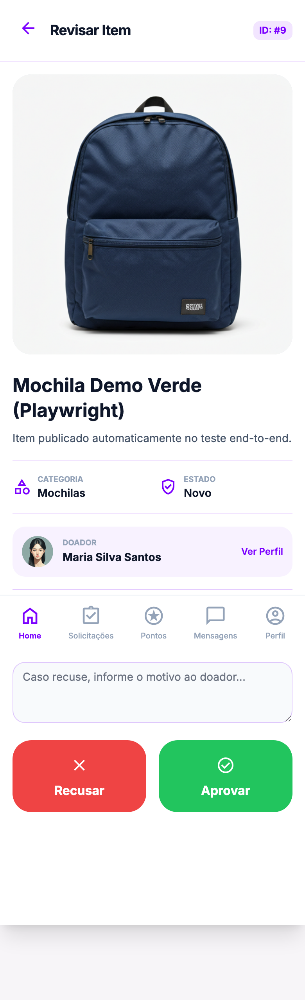{ width=32% }
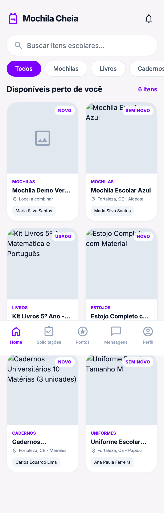{ width=32% }

### Fluxo do receptor

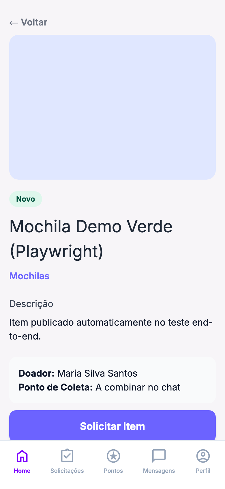{ width=32% }
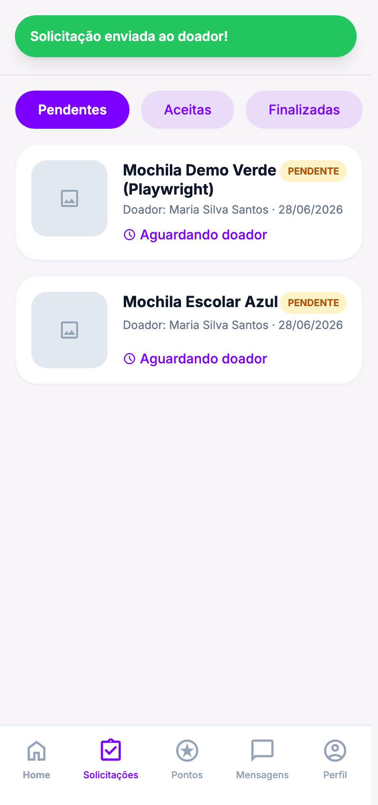{ width=32% }

---

## 5. Credenciais de demonstração

Todos os usuários de exemplo usam a senha **`senha123`**.

| Perfil | E-mail | Usar para demonstrar |
|---|---|---|
| Doador | `maria.silva@email.com` | Publicar item, "meus itens" |
| Receptor | `joao.pedro@email.com` | Buscar, solicitar, "minhas solicitações" |
| Moderador | `admin@mochilacheia.com` | Fila, aprovar/recusar |

---

## 6. Como rodar localmente

```bash
python -m venv .venv && source .venv/bin/activate
pip install -r requirements.txt
flask --app run init-db        # cria o banco + dados de exemplo
flask --app run run --debug    # http://127.0.0.1:5000
```

---

## 7. O que ainda falta (por pessoa)

| Responsável | Pendência | Prioridade |
|---|---|---|
| **Lucas** | Chat (mensagens) e notificações ainda são **visuais** — falta ligar ao banco | Média |
| **Júlio** | Edição de item (POST de `/itens/<id>/editar`) e upload real de foto | Média |
| **Júlio** | Doador aceitar/recusar a solicitação recebida (hoje cobrimos receptor → solicitar) | Média |
| **Maria** | Preencher os 3 `[INSERIR…]` do relatório (link do vídeo + evidências) | **Alta** |
| **Todos** | Gravar o vídeo (≤5 min) seguindo o roteiro do guia | **Alta** |

> As fotos dos itens de exemplo apontam para URLs fictícias (`exemplo.com`), por
> isso aparecem como espaço reservado nas telas. Quando o upload real entrar
> (item acima), some o problema. Não afeta a nota — é dado de teste.

---

## 8. Observações técnicas (decisões desta rodada)

- **Senhas:** novas contas usam **bcrypt** (como descrito no relatório). Os
  usuários do seed continuam com SHA-256, e o `verificar_senha` aceita os dois —
  assim a base de demonstração continua logando.
- **Correção no seed:** o hash das senhas de exemplo estava **errado** (não batia
  com `senha123`); foi corrigido para o SHA-256 correto.
- **Padrão Repository mantido:** nenhum SQL foi parar dentro dos controllers —
  todo acesso ao banco passa pelos repositórios, como já estava documentado.
- **Proteção por perfil:** as rotas de moderação exigem `tipo == 'moderador'`
  (retornam 403 para os demais), validando a separação de acesso do relatório.
