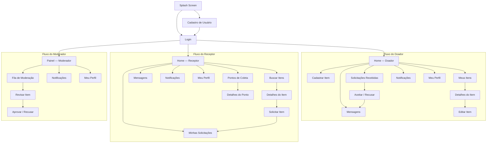
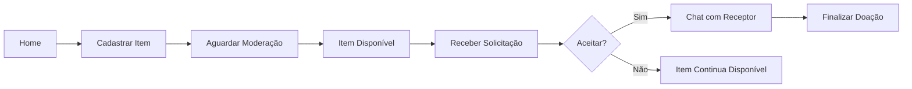
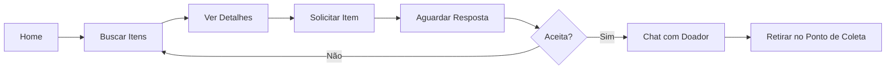
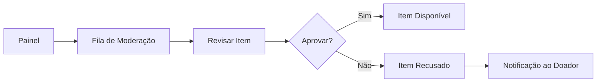

# Sitemap do MVP — Mochila Cheia

**Projeto Integrado II [ADS0013]**  
**Entregável Parcial 3 (EP3) — Prototipação de Wireframe e Sitemap**

---

## 1. Visão Geral

O sitemap a seguir representa a arquitetura de navegação completa do MVP da plataforma **Mochila Cheia**. A estrutura foi derivada diretamente das entidades do banco de dados (USUARIO, ITEM, CATEGORIA, SOLICITACAO, MENSAGEM, NOTIFICACAO, PONTO_COLETA) e dos fluxos de negócio modelados nas classes Python do projeto.

A plataforma possui **três perfis de usuário** — Doador, Receptor e Moderador —, cada um com um fluxo de navegação próprio, mas compartilhando telas comuns (Login, Cadastro, Perfil, Mensagens e Notificações).

---

## 2. Diagrama Geral de Navegação

---

## 3. Fluxos Detalhados por Perfil

### 3.1 Fluxo do Doador

**Descrição:** O doador cadastra um item que passa pela moderação. Após aprovação, o item fica disponível e o doador pode aceitar ou recusar solicitações. Ao aceitar, abre-se o chat para combinar a entrega e, por fim, a doação é finalizada.

### 3.2 Fluxo do Receptor

**Descrição:** O receptor busca itens por categoria ou palavra-chave, visualiza os detalhes e envia uma solicitação. Se o doador aceitar, ambos conversam pelo chat e combinam a retirada em um ponto de coleta.

### 3.3 Fluxo do Moderador

**Descrição:** O moderador acessa a fila de itens pendentes, revisa cada item (título, descrição, foto, estado) e decide aprovar ou recusar. O doador recebe uma notificação com o resultado.

---

## 4. Inventário de Telas

| # | Tela | Perfil(is) | Descrição | Funcionalidades Principais |
|---|------|------------|-----------|---------------------------|
| 1 | **Splash Screen** | Todos | Tela inicial com logotipo e carregamento | Exibição da marca, verificação de sessão ativa |
| 2 | **Login** | Todos | Autenticação por e-mail e senha | Campos de e-mail e senha, botão entrar, link "Esqueci a senha", link para cadastro |
| 3 | **Cadastro** | Todos | Registro de novo usuário | Campos: nome, e-mail, senha, telefone, endereço, tipo de usuário (doador/receptor) |
| 4 | **Home — Doador** | Doador | Dashboard com resumo da atividade | Cards de resumo (itens ativos, solicitações pendentes), acesso rápido a "Cadastrar Item" |
| 5 | **Home — Receptor** | Receptor | Feed de itens disponíveis | Grid/lista de itens, barra de busca, filtros por categoria e localização |
| 6 | **Painel — Moderador** | Moderador | Dashboard de moderação | Contador de itens pendentes, acesso à fila de moderação |
| 7 | **Cadastrar Item** | Doador | Formulário de cadastro de item | Campos: título, descrição, categoria (select), estado de conservação, foto, ponto de coleta (opcional) |
| 8 | **Meus Itens** | Doador | Lista de itens cadastrados pelo doador | Listagem com filtro por status (pendente, disponível, reservado, doado), ações por item |
| 9 | **Detalhes do Item** | Doador / Receptor | Visualização completa de um item | Foto, título, descrição, categoria, estado, doador, ponto de coleta, botão "Solicitar" (receptor) ou "Editar" (doador) |
| 10 | **Editar Item** | Doador | Edição dos dados de um item cadastrado | Mesmos campos do cadastro, pré-preenchidos |
| 11 | **Buscar Itens** | Receptor | Busca e filtragem de itens disponíveis | Barra de pesquisa, filtros por categoria, localização e estado de conservação |
| 12 | **Solicitar Item** | Receptor | Confirmação de solicitação | Resumo do item, campo de observações, botão confirmar |
| 13 | **Solicitações Recebidas** | Doador | Lista de solicitações sobre seus itens | Nome do solicitante, item solicitado, data, status, botões aceitar/recusar |
| 14 | **Minhas Solicitações** | Receptor | Lista de solicitações enviadas | Item solicitado, status (pendente, aceita, recusada, finalizada), data |
| 15 | **Mensagens** | Doador / Receptor | Lista de conversas ativas | Lista de contatos com última mensagem, indicador de não lidas |
| 16 | **Chat** | Doador / Receptor | Conversa individual | Histórico de mensagens, campo de texto, botão enviar |
| 17 | **Notificações** | Todos | Lista de alertas do sistema | Título, mensagem, data, status (lida/não lida), link para o contexto |
| 18 | **Meu Perfil** | Todos | Visualização e edição de dados pessoais | Nome, e-mail, telefone, endereço, botão editar, botão sair |
| 19 | **Pontos de Coleta** | Receptor | Lista/mapa de pontos de coleta | Nome, endereço, horário, responsável, telefone |
| 20 | **Detalhes do Ponto** | Receptor | Informações completas de um ponto | Endereço completo, horário de funcionamento, contato, itens disponíveis no ponto |
| 21 | **Fila de Moderação** | Moderador | Lista de itens aguardando aprovação | Título, doador, data de cadastro, botão "Revisar" |
| 22 | **Revisar Item** | Moderador | Revisão detalhada para aprovação | Todos os dados do item, botões "Aprovar" e "Recusar" com campo de justificativa |

---

## 5. Navegação Global (Bottom Tab Bar)

A navegação principal do aplicativo utiliza uma **barra inferior (bottom navigation)** com ícones, adaptada ao perfil do usuário:

### Doador

| Ícone | Aba | Destino |
|-------|-----|---------|
| 🏠 | Home | Home — Doador |
| ➕ | Cadastrar | Cadastrar Item |
| 📋 | Solicitações | Solicitações Recebidas |
| 💬 | Mensagens | Lista de Mensagens |
| 👤 | Perfil | Meu Perfil |

### Receptor

| Ícone | Aba | Destino |
|-------|-----|---------|
| 🏠 | Home | Home — Receptor (Buscar Itens) |
| 📋 | Solicitações | Minhas Solicitações |
| 📍 | Pontos | Pontos de Coleta |
| 💬 | Mensagens | Lista de Mensagens |
| 👤 | Perfil | Meu Perfil |

### Moderador

| Ícone | Aba | Destino |
|-------|-----|---------|
| 🏠 | Painel | Painel — Moderador |
| 📋 | Fila | Fila de Moderação |
| 🔔 | Notificações | Notificações |
| 👤 | Perfil | Meu Perfil |

---

## 6. Justificativa da Hierarquia de Navegação

### Por que três fluxos separados?

Cada tipo de usuário tem **objetivos distintos**:
- O **doador** quer publicar itens e gerenciar solicitações.
- O **receptor** quer encontrar e solicitar itens.
- O **moderador** quer garantir a qualidade dos itens publicados.

Separar os fluxos evita sobrecarga cognitiva e mantém cada interface focada nas tarefas do perfil correspondente, alinhando-se ao princípio de **design minimalista** das heurísticas de Nielsen.

### Por que bottom navigation?

A barra inferior é o padrão de navegação mais reconhecido em aplicativos mobile (Material Design e Human Interface Guidelines). Ela permite acesso direto às seções principais com **no máximo um toque**, seguindo o princípio de **reconhecimento em vez de memorização**.

### Por que a busca é a Home do Receptor?

O principal objetivo do receptor ao abrir o app é **encontrar materiais escolares**. Colocar a busca como tela inicial reduz o número de passos para a ação mais frequente, aplicando o princípio de **flexibilidade e eficiência de uso**.

### Por que o Chat está vinculado à Solicitação?

As mensagens entre doador e receptor só fazem sentido no contexto de uma solicitação específica. Vincular o chat à solicitação mantém o **contexto da conversa** e facilita o rastreamento, seguindo o princípio de **correspondência entre o sistema e o mundo real**.

---

## 7. Relação Sitemap × Banco de Dados

| Tela | Tabela(s) Principal(is) |
|------|------------------------|
| Login / Cadastro | USUARIO |
| Cadastrar Item / Editar Item | ITEM, CATEGORIA, PONTO_COLETA |
| Buscar Itens / Detalhes do Item | ITEM, CATEGORIA, USUARIO |
| Solicitar Item / Minhas Solicitações / Solicitações Recebidas | SOLICITACAO, ITEM, USUARIO |
| Mensagens / Chat | MENSAGEM, SOLICITACAO, USUARIO |
| Notificações | NOTIFICACAO, USUARIO |
| Pontos de Coleta | PONTO_COLETA |
| Fila de Moderação / Revisar Item | ITEM, USUARIO (moderador) |
| Meu Perfil | USUARIO |

Todas as 7 tabelas do schema são utilizadas pelo menos uma vez no sitemap, garantindo que a interface cobre **100% das funcionalidades previstas no banco de dados**.
