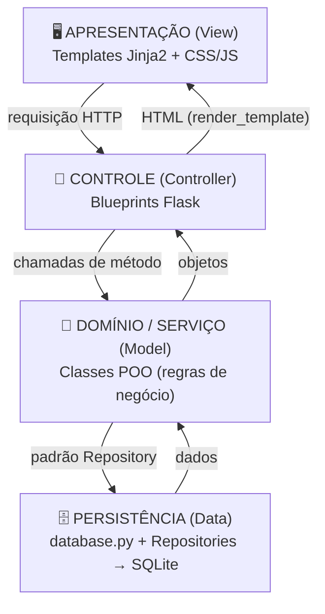
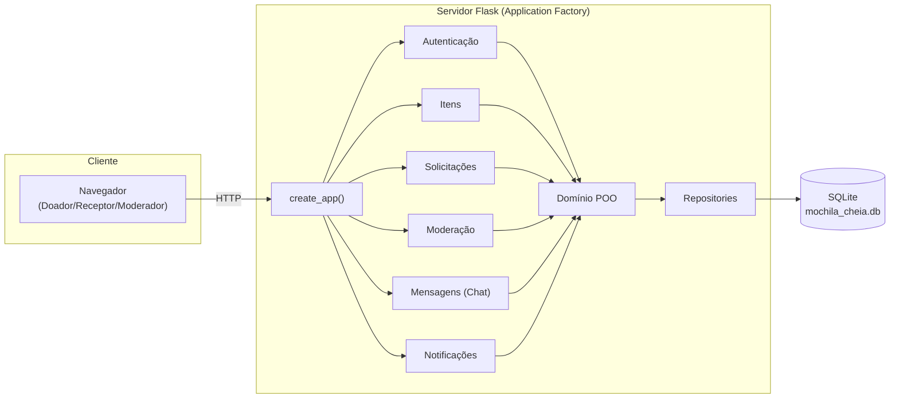
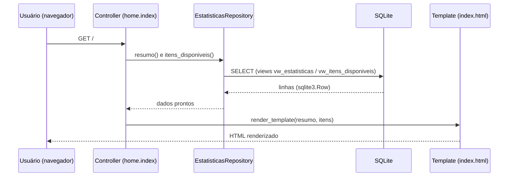
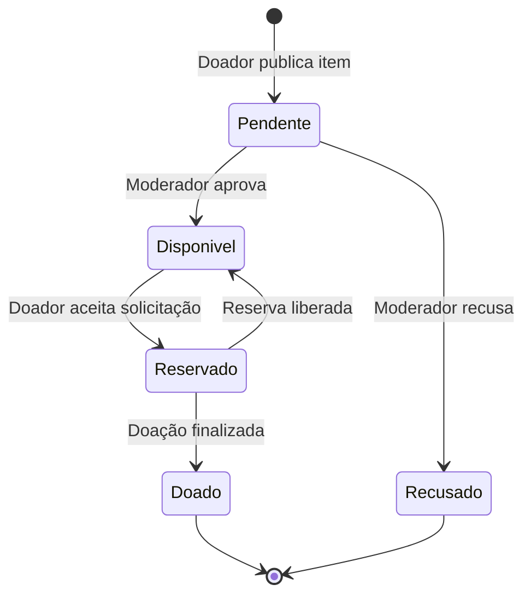

# Diagramas Arquiteturais — EP2 (PI3) · Mochila Cheia

Diagramas do modelo arquitetural do MVP Web. Renderizam diretamente no GitHub
(Mermaid). Complementam o documento `docs/EP2-PI3_Arquitetura.md`.

---

## 1. Diagrama de Camadas

Mostra a divisão em quatro camadas e o sentido das dependências.

---

## 2. Diagrama de Componentes

Detalha os módulos da aplicação e suas comunicações.

---

## 3. Fluxo de uma Requisição (exemplo: página inicial)

Sequência de uma requisição atravessando todas as camadas.

---

## 4. Fluxo de Doação (visão de negócio)

Os estados do item ao longo do processo, controlados pela camada de domínio.

